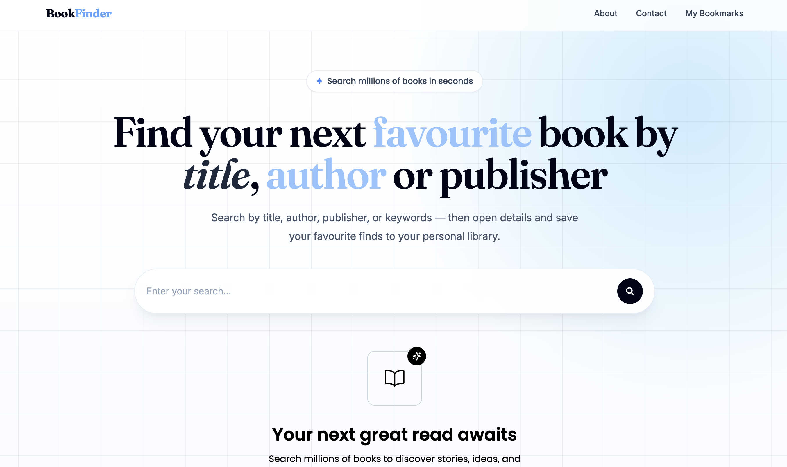
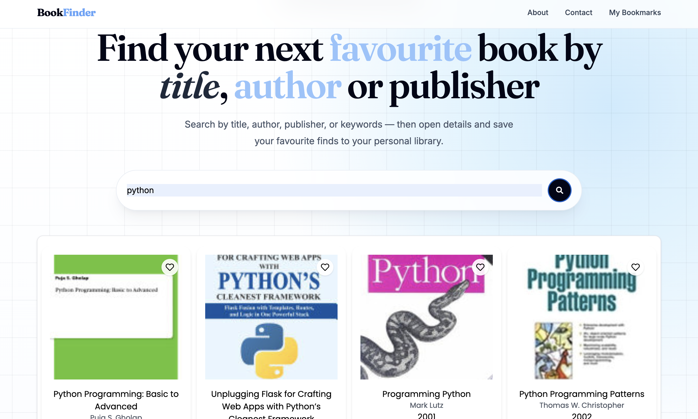
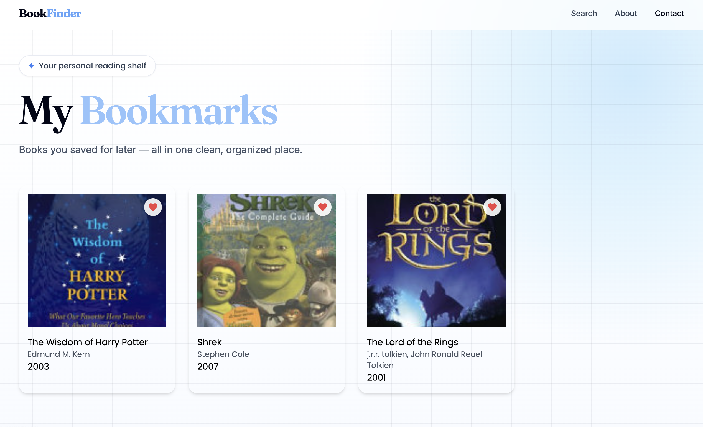
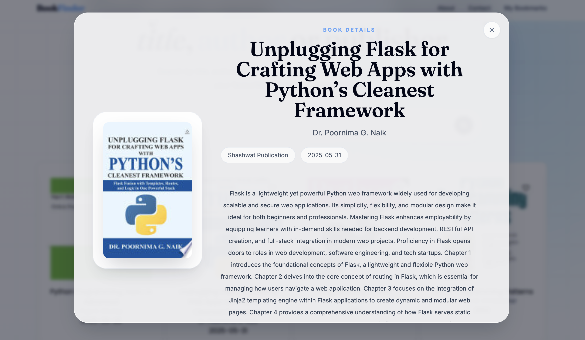

# 📚 BookFinder

BookFinder is a responsive React application that allows users to search for books, explore book details, and save their favorite books for later. The application integrates with a book API to provide real-time search results and uses local storage to persist user favorites across browser sessions.

## 🚀 Live Demo

🔗 Live Site: [Add Vercel Link Here]

## 📸 Preview

Add screenshots here:









---

## ✨ Features

* Search for books by title, author, or keyword
* Real-time API-powered search results
* Save favorite books for later
* Persistent favorites using localStorage
* Responsive design for desktop and mobile devices
* Loading states for improved user experience
* Error handling for failed API requests
* Empty state handling when no books are found
* Clean and intuitive user interface

---

## 🛠️ Built With

* React
* JavaScript (ES6+)
* Vite
* CSS / Tailwind CSS
* Book API
* Local Storage

---

## 📖 What I Learned

This project helped me strengthen my understanding of:

* React state management
* Working with external APIs
* Asynchronous JavaScript (async/await)
* Conditional rendering
* Handling loading, error, and empty states
* Persisting data with localStorage
* Building responsive user interfaces

---

## ⚙️ Installation

Clone the repository:

```bash
git clone https://github.com/your-username/bookfinder.git
```

Navigate to the project folder:

```bash
cd bookfinder
```

Install dependencies:

```bash
npm install
```

Start the development server:

```bash
npm run dev
```

Build for production:

```bash
npm run build
```

---

## 🎯 Future Improvements

* User authentication
* Reading lists and book collections
* Dark mode support
* Advanced filtering options
* Backend database for favorites
* Book recommendations based on saved books

---

## 👩‍💻 Author

**Zarah Sada**

Frontend Developer passionate about building responsive and user-friendly web applications.

GitHub: https://github.com/your-github-username

LinkedIn: https://linkedin.com/in/your-linkedin-profile

